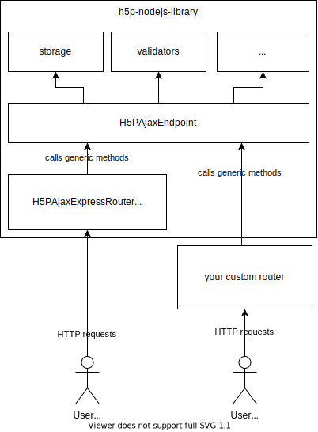

# Handling AJAX requests

There are two ways of handling AJAX requests: You can use the out-of-the-box
[Express adapter](#handling-requests-with-the-express-adapter)
or [write your own custom router](#handling-requests-yourself):



## Handling requests with the Express adapter

Your implementation must process requests to several endpoints and relay them to
the H5PEditor or H5PPlayer objects. All Ajax endpoints are already implemented
in the [Express adapter](/packages/h5p-express/src/H5PAjaxRouter/H5PAjaxExpressRouter.ts),
which you can use like this:

Import the Express adapter router like this:

```typescript
import h5pAjaxExpressRouter from '@lumieducation/h5p-express';
```

or in classic JS style:

```javascript
const h5pAjaxExpressRouter = require('@lumieducation/h5p-express');
```

Then add the router to your Express app like this

```javascript
app.use(
    // server is an object initialized with express()
    '/h5p', // the route under which all the Ajax calls will be registered
    h5pAjaxExpressRouter(
        h5pEditor, // an H5P.H5PEditor object
        path.resolve('h5p/core'), // the path to the h5p core files (of the player)
        path.resolve('h5p/editor'), // the path to the h5p core files (of the editor)
        routeOptions, // the options are optional and can be left out
        languageOverride // (optional) can be used to override the language used by i18next http middleware
    )
);
```

Note that the Express adapter does not include pages to create, editor, view,
list or delete content!

You can customize which endpoints you want to use by setting the respective
flags in the `options` object. By default, the adapter will handle **all**
routes and you can turn individual ones off by setting `routeXX` to false. You
can also turn off the error handling (`handleErrors: false`). Normally, the
router will send back localized responses that the H5P client can understand. If
you turn error handling off, the routes will throw errors that you have to
handle yourself!

**IMPORTANT:** The adapter expects the requests object of Express to be extended
like this:

```typescript
{
    user: IUser, // must be populated with information about the user (mostly id and access rights)
    t: (errorId: string, replacements: {[key: string]: string }) => string
}
```

The function `t` must return the string for the errorId translated into the
user's or the content's language. Replacements are added to the localized string
with curly braces:  It is suggested you use [i18next](https://www.i18next.com/)
for localization, but you can use any library, as long as you make sure the
function t is added to the request object.

## Handling requests yourself

If you use a different HTTP framework than Express, you can write your own
adapter. In this case, you must instantiate `H5PAjaxEndpoint` and call its
methods when your routes are called.

The table below shows which routes you must implement and which ones can be left
out. Note that routes of the Type _H5P_ are needed by the H5P client and must be
implemented in some way. Routes of the type _custom_ are specific to
@lumieducation/h5p-server. The exact name of the routes can be [configured in
IH5PConfig](ajax-endpoints.md#configuring-custom-endpoint-routes) and might be
different in your setup.

| HTTP Verb | Route | method in H5PAjaxEndpoint | Type | Required |
| :--- | :--- | :--- | :--- | :--- |
| GET | /ajax | getAjax | H5P | yes |
| GET | /content | getContentFile | H5P | depends on content storage: files in FileContentStorage can also be served statically |
| GET | /libraries | getLibraryFile | H5P | depends on library storage: files in FileLibraryStorage can also be served statically |
| GET | /temp-files | getTemporaryFile | H5P | yes |
| POST | /ajax | postAjax | H5P | yes |
| GET | /params | getContentParameters | custom | if you use the default renderer script of the editor |
| GET | /download | getDownload | custom | no |

Consult the [documentation of
`H5PAjaxEndpoint`](/packages/h5p-server/src/H5PAjaxEndpoint.ts) for details on
who to retrieve the required parameters from the HTTP requests. You can also
look at the [Express Ajax Adapter](/packages/h5p-express/src/H5PAjaxRouter/H5PAjaxExpressController.ts) as
an example.

## Configuring custom endpoint routes

The H5P client (run in the browser by the user) can be configured to use
custom AJAX request endpoints. These can be configured in the config object. The
relevant settings (including defaults) are:

```javascript
const config = {
    ajaxUrl: '/ajax?action=',   // URL prefix for all AJAX requests
    baseUrl: '/h5p',            // a prefix added to all Ajax URLs
    contentFilesUrl: '/content',// base path for content files (e.g. images, video)
    coreUrl: '/core',           // URL of static player "core files"
    downloadUrl: '/download',   // URL to download h5p packages
    editorLibraryUrl: '/editor',// URL of static editor "core files" (not the content types!)
    librariesUrl: '/libraries', // URL at which library files (= content types) can be retrieved
    paramsUrl: '/params'        // URL at which the parameters (= content.json) of content can be retrieved
    playUrl: '/play'            // URL at which content can be displayed
    ... // further configuration values
}
```
