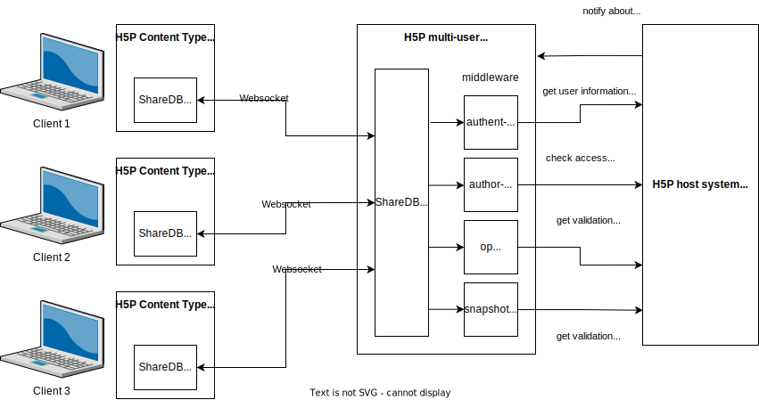

# Multi-user state system for H5P: Proposal 1 (Feb 2022)

This document describes an extension for H5P that adds multi-user capabilities to the H5P core and can be used in conjunction with existing open-source H5P implementations.

## User stories

- When users interact with multi-user H5P content, their actions immediately become visible to other users. Thus users can collaboratively work or play with the same content while avoiding synchronization conflicts.
- Users resume with the previous state whenever they return to a piece of content. The state they see is exactly how they left. (Unlike with the current single-user H5P user state, which doesn't restore everything)
- Content type authors can restrict what parts of the state regular or anonymous users can see (e.g. they can't see the exact voting behavior of other users in a survey app, only summative outcomes). Only priviliged users (teachers) can see all data.
- Content type authors can restrict what actions regular or anonymous users can see (e.g. they can't reset the state or can't move to a new phase in games). Only privileged users can perform all actions.
- Content authors can use the regular H5P content editor to create content.
- Content authors can add multi-user content as sub-content to other H5P content (e.g. Interactive Book or Course Presentation).
- Content creators can create interactive elements that they can add to static content like polls, surveys or reaction apps.
- Content creators can create activities, which are guided by a teacher on the projection and in which the users participate from their mobile devices (like Kahoot, Quizlet Live or Mentimeter).
- Content creators can create game-like activities, which are self-paced (and don't require teacher guidance), like quiz competitions. 
- Users are protected from malicious states (XSS attacks) or from malicious users who want to damage the user state (broken content).
- Users are protected from cheaters (e.g. users assigning their own scores).
- Administrators can install multi-user content types like regular H5P content types.
- Administrators don't have to worry about security implications for their server when installing multi-user content types.
- Administrators can easily set up the multi-user extension and connect it to the H5P system.
- Integration developers can add the extension to their existing H5P integration (Moodle, Drupal, Ilias, WordPress etc.) quickly.

## Architecture

PHP, which is used by the H5P core and by all common integrations (WordPress, Moodle, Drupal), isn't really suitable for live interaction applications: Most of them keep connection alive only on a per-request basis and these systems aren't made for Websocket usage. In contrast, NodeJS  has excellent Websocket support and a huge library ecosystem, which greatly speeds up development. That's why a NodeJS stack was chosen for the implementation of the multi-user state system.

The system leverages several existing technologies:

- [ShareDB](https://share.github.io/sharedb/) - a server and client library that offer real time collaboration with conflict resolution using [Operational Transformations](https://en.wikipedia.org/wiki/Operational_transformation)
- [JSONPath](https://tools.ietf.org/id/draft-goessner-dispatch-jsonpath-00.html) - a querying language in JSON objects (in the [JSONPath-plus](https://www.npmjs.com/package/jsonpath-plus) flavor)
- [JSON Schema](https://json-schema.org/) - a schema definition language
- Websockets

In essence, the shared-state server is a ShareDB server that keeps a central "document" (in ShareDB terms) in memory and in a database that can be modified by clients through operations ("ops"). ShareDB keeps an in-memory "snapshot" of the current state on the server and makes sure that the clients have the same snapshot (by transmitting the ops through Websockets to all clients). Conflicts in ops (e.g. users have changed the same properties) are either automatically resolved or reverted. The H5P multi-user state system puts some essential functionality on top:

- authentication (every op is authenticated to avoid abuse)
- authorization (access to states is denied to unauthorized users in general; certain ops are only allowed for certain user, depending on user type and content access)
- validation (ops must conform to schemas and conditions defined by the content type author)

This is necessary as the client cannot be trusted - it could be a malicious client manipulating the state to take over other user accounts (XSS), make it invalid (breaks user experience) or cheat.

As the information needed to make many of these decisions (e.g. "Is User X allowed to do operation Y on content Z?") must be retrieved from the host system, which manages users and content objects (e.g. WordPress or Moodle), the multi-user state system can access this information from the host system. It also has to share authentication with the host system.



## Microservice communication between the multi-user state system and the H5P Host

There are several cases in which the multi-user state system needs to retrieve data from the H5P host system (e.g. WordPress):

- get library metadata (to check what validations should be performed and if the API required by the content type is supported by the microservice)
- get library files (to load the validators that are part of the content type)
- get content metadata (to get the exact library version of the content type)
- get content parameters (to make it available to validation checks)
- authenticate Websocket initialization user request
- get permission of user for specific content object

The H5P host system has to notify the multi-user state system of certain events:

- content was deleted (state must be deleted, too, and users must be notified)
- content was updated (state must be deleted, too, and users must be notified)
- content was created (to be implemented; useful when there will be state projection)

There are several ways how this can or could be achieved:

- shared sessions (e.g. shared state server re-uses session of WordPress)
- usage of the same SSO (e.g. Open ID Connect; not done at the moment)
- multi-user state system directly accesses the database used by the host (e.g. MySQL in WordPress)
- multi-user state system calls the API of the host authenticated by a token (theoretically possible, but not done at the moment)
- multi-user state system calls public APIs of the host (e.g. download JSON files through HTTP)

## Content-type-specific validation and authorization

Content *type* authors must specify validators to prevent abuse from malicious clients. There are two types of validators and each type is applied to ops and snapshots (in this order):

- ops are checked against JSON schema validators (JSON Schema)
- ops are checked against op logic checks
- snapshot are checked against JSON schema validators (JSON Schema)
- snapshot are checked against snapshot logic checks

### JSON schema validation

The system validates received ops and the resulting snapshot against JSON schema validators (JSON Schema draft 2020-12). It passes in the batch op list (a client can submit multiple ops at the same time). If the validation fails, the ops are rejected. It is important that content type authors are as strict as possible in the JSON schemas, so that they make it impossible for undesired operations to pass through.

#### OP schema validator

Must be put into `opSchema.json` in the base directory of the content type. The validator checks the op batches it receives from the client. Example:

```json
[{
  "p": ["a", "path", "in", "the", "state"],
  "oi": "insert this string into the object referenced by the path"
}]
```

Possible ops can be found in the [JSON0 documentation](https://github.com/ottypes/json0). The op schema must be written in a way that **all possible** op batches supported by the content types pass.

#### OP snapshot validator

Must be put into `snapshotSchema.json` in the base directory of the content type. The validator checks the snapshot that is the result of the applied ops. The state is fully custom and defined by the content type author.

### Logic checks

After the schema validation was successful, the system performs "logic checks" against the ops and snapshot. The logic checks for ops must be in `opLogicCheck.json` and the ones for snapshots in `snapshotLogicCheck.json` in the base directory of the content type. Logic checks can be used to check logical connections between data. Examples:

- Is the userId the user has submitted as part of a op identical to the one we got from authentication?
- Does the user have the required permission level to perform a certain operation? (Checks `$.context.permission` and other operation data)
- Does the snapshot or operation data conform to what is set in the parameters?

Logic checks are custom declarative operations that are inspired by the MongoDB query language (but not exactly the same). They combine Mongo-style queries with JSON Path queries. Every logic check consists of a object with either an operator as a property or a JSON Path.

#### Examples of valid logic checks

Check if the result of `$.context.permission` (= JSON Path expression) equals `privileged` (string literal):
```json
{ "$.context.permission": "privileged" }
```

Check if the result of the JSON Path expression `$.create` is defined (= the object exists):
```json
{
  "$defined": {
     "$query": "$.create"
  }
}
```

Check if one of several checks are successful (logical or):

```json
{
  "$or": [
    { "$.op[0].p": ["votesUp", 0] },
    { "$.op[0].p": ["votesDown", 0] }
  ]
}
```

Check if the result of the JSON Path evaluation of `$.snapshot.answers.length` is less than or equal the result of the JSON Path evaluation of `$.params.questions.params.choices.length`:
```json
{
  "$.snapshot.answers.length": {
    "$lte": {
      "$query": "$.params.questions.params.choices.length"
    }
  }
}
```

#### Example of a logic check file
A logic check file contains an array of logic checks. All logic checks must apply for the validation to be successful. Example:
```json
[
  {
    "$or": [
      {
        "$defined": {
          "$query": "$.create"
        }
      },
      {
        "$and": [
          {
            "$or": [
              { "$.op[0].p": ["votesUp", 0] },
              { "$.op[0].p": ["votesDown", 0] }
            ]
          },
          {
            "$.op[0].li": {
              "$query": "$.context.user.id"
            }
          }
        ]
      },
      {
        "$and": [
          { "$.op[0].p": ["votesDown"] },
          { "$.op[1].p": ["votesUp"] },
          { "$.op[0].oi": [] },
          { "$.op[1].oi": [] },
          { "$.context.permission": "privileged" }
        ]
      }
    ]
  }
]
```

#### Objects passed into logic checks

The op logic check receives an object of the following structure:

```typescript
{
  op: [
    { 
    	"p": ["path", "..."],
    	"operation": "value"
    },
    // more ops ...    
  ],
  create: any, // the create object (see ShareDB docs)
  params: any, // the parameters of the h5p content object
  context: {
  	user: {
  			email: string; // the user's email address (if available)
  			id: string; // user id (can be anything)
  			name: string; // display name
  	},
  	permission: "privileged" | "user",  
  },
  snapshot: any // the  resulting snapshot of the op
}
```

The snapshot logic check receives an object of the following structure:

```typescript
{
  snapshot: any, // the new snapshot
  params: any, // the parameters of the h5p content object
  context: {
  	user: {
  			email: string; // the user's email address (if available)
  			id: string; // user id (can be anything)
  			name: string; // display name
  	},
  	permission: "privileged" | "user",  
  }
}
```

#### Logic check keywords

Currently the keywords below are supported. You can use any of them in the top-level list of a logic check file.

##### Comparison operators

Syntax:

```json
{
  "$keyword": "literal"
}
// or
{
  "left": {
  	"$query": "$.json.path"
  }
}
```

Available keywords:

- $eq (equals; converts strings to numbers if necessary)
- $ne (not equal; converts strings to numbers if necessary)
- $gt (greater than; converts strings to numbers if necessary)
- $gte (greater than or equal; converts strings to numbers if necessary)
- $lt (less than; converts strings to numbers if necessary)
- $lte (less than or equal; converts strings to numbers if necessary)
- $in (checks if left expression is a subsection of right expression; works on array)
- $nin (checks if none of the left expression are in the right expression; works on array)

Comparison operators can take either literals as their right expression or a query, which is executed before the comparison is performed. Valid literals are: `number`, `string`, `boolean` and `arrays` of these literals.

##### Logical operators

Syntax:

```json
{
    "$operator": [
        // ... comparisons, queries or logical operators
    ]
}
// or
{
    "$operator": {
        // comparison, query or logical operator
    }
}
```

Available keywords:

- $and: logical and (takes an array as argument)
- $or: logical or (takes an array as argument)
- $nor: logical nor (takes an array of exactly two items as argument)
- $not: logical nor (takes a single comparison, query or logical operator as argument)
- $defined: checks if the result of a query is defined (takes a single query as argument)

#### JSON Path expressions

JSON Path expressions can either be put into the left side of a comparison operator:

```json
{
  "$.a.json.path[1].expression.*~": {
      // comparison operator
  }
}
```

If you need a JSON Path expression as the argument of a comparison operator or a logical operator, you have to use a query object (to keep a JSON Path expression apart from a string literal):

```json
{
    "$defined": {
        "$query": "$.a.json.path[1].expression.*~"
    }
}
```

Notes:

- You can use [JSONPath-plus](https://www.npmjs.com/package/jsonpath-plus) extensions to the standard 
- Code execution in filters isn't allowed (security reasons)
- Evaluation results are unwrapped into literals if they are an array with a single item

